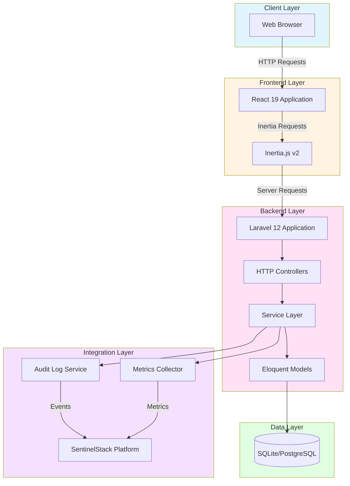

# ClinicFlow Architecture

## Overview

ClinicFlow follows a layered architecture pattern optimized for maintainability, testability, and clear separation of concerns. The application is built on Laravel 12 with a React 19 frontend using Inertia.js v2, providing a single-page application experience while maintaining server-side routing and state management.

## System Architecture



## Component Responsibilities

### Frontend Layer

**React Application (React 19)**
- Component-based UI rendering
- Client-side interactivity and state management
- Form handling and validation feedback
- Responsive design with Tailwind CSS v4

**Inertia.js v2**
- Server-side routing with SPA experience
- Shared state management between frontend and backend
- Form submission and error handling
- Page transitions and loading states

### Backend Layer

**Laravel Application (Laravel 12)**
- HTTP request handling and routing
- Middleware pipeline for authentication and authorization
- Dependency injection container
- Configuration management

**HTTP Controllers**
- Request validation and authorization
- Business logic orchestration
- Response formatting for Inertia
- Error handling and exception transformation

**Service Layer**
- Business logic implementation
- Domain-specific operations
- Transaction management
- Integration with external services
- Patient-specific services:
  - `PatientAuthService`: Handles magic link generation, verification, and email sending
  - `PatientAppointmentService`: Manages patient appointment viewing and cancellation
  - `PatientProfileService`: Handles patient profile updates with field restrictions

**Eloquent Models**
- Database abstraction and ORM
- Relationship definitions
- Query scopes and accessors
- Data validation and casting

### Data Layer

**Database (SQLite/PostgreSQL)**
- Persistent data storage
- Transaction support
- Referential integrity enforcement
- Indexed queries for performance

### Integration Layer

**SentinelStack Integration**
- Audit log forwarding
- Metrics collection and submission
- Incident event reporting
- Health status updates

**Audit Log Service**
- Immutable action logging
- Event serialization
- Log routing and formatting

**Metrics Collector**
- Performance metric capture
- Error rate tracking
- Latency measurement
- Uptime calculation

## Technology Choices and Rationale

### Laravel 12

Laravel provides a robust, well-documented framework with:
- Strong ecosystem and community support
- Built-in authentication and authorization
- Excellent testing framework integration
- Mature ORM for database interactions
- Comprehensive security features

### React 19 with Inertia.js v2

Inertia.js bridges server-side and client-side development:
- Maintains Laravel routing and controllers
- Reduces API complexity for simple CRUD operations
- Provides SPA experience without separate API
- Simplifies authentication and authorization flow
- Enables server-side rendering when needed

### Tailwind CSS v4

Utility-first CSS framework offering:
- Rapid UI development
- Consistent design system
- Responsive design utilities
- Dark mode support
- Minimal runtime overhead

### SQLite (Development) / PostgreSQL (Production)

SQLite enables zero-configuration development:
- No separate database server required
- Fast iteration and testing
- File-based storage for easy reset

PostgreSQL provides production-grade capabilities:
- ACID compliance
- Advanced indexing options
- JSON column support
- Full-text search capabilities
- Proven healthcare industry usage

## Scalability Considerations

### Current Architecture

The application is designed for moderate scale:
- Single-server deployment
- Monolithic application structure
- Shared database connections
- Synchronous request handling

### Future Scaling Options

**Horizontal Scaling**
- Stateless application design supports load balancing
- Session storage externalization (Redis/database)
- Database connection pooling
- CDN for static asset delivery

**Vertical Scaling**
- Optimized database queries with eager loading
- Query result caching where appropriate
- Background job processing for heavy operations
- Asset optimization and compression

**Architectural Evolution**
- Service extraction for independent scaling
- API layer for mobile or third-party integration
- Event-driven architecture for async operations
- Microservices migration if required

## Security Architecture

### Authentication

**Staff Authentication:**
- Laravel Fortify for staff authentication
- Two-factor authentication support
- Secure password hashing (bcrypt)
- Session-based authentication with CSRF protection
- Uses `web` guard for staff users

**Patient Authentication:**
- Magic link (passwordless) authentication for patients
- Separate `patient` guard for patient authentication
- Email-based token verification
- Single-use tokens with 30-minute expiration
- Session-based authentication with CSRF protection
- Patients use `PatientAuthService` for authentication logic
- Guard separation ensures patients cannot access staff routes and vice versa

### Authorization

- Role-based access control (RBAC)
- Policy-based authorization
- Middleware for route protection
- Resource-level permission checks

### Data Protection

- Encryption at rest (database level)
- Encryption in transit (HTTPS/TLS)
- Input validation and sanitization
- SQL injection prevention via Eloquent ORM
- XSS protection via React's built-in escaping

### Audit and Compliance

- Immutable audit logging
- User action tracking
- Data access logging
- Security event recording
- Integration with SentinelStack for centralized audit trails

## Deployment Architecture

### Development Environment

```
Developer Machine
├── PHP 8.3 with Laravel
├── Node.js with Vite dev server
├── SQLite database
└── Local development server
```

### Production-Ready Architecture

```
Internet
  │
  ├── Load Balancer
  │     │
  │     ├── Application Server 1
  │     │     ├── Laravel Application
  │     │     └── PHP-FPM
  │     │
  │     └── Application Server 2
  │           ├── Laravel Application
  │           └── PHP-FPM
  │
  ├── Database Server
  │     └── PostgreSQL (Primary/Replica)
  │
  ├── Cache Layer
  │     └── Redis
  │
  └── External Services
        └── SentinelStack Platform
```

## Performance Considerations

### Frontend Optimization

- Code splitting and lazy loading
- Asset bundling and minification
- Image optimization
- Browser caching strategies

### Backend Optimization

- Query optimization with eager loading
- Database indexing on foreign keys and search columns
- Response caching for read-heavy operations
- Background job processing for time-intensive tasks

### Database Optimization

- Appropriate indexes on frequently queried columns
- Query result pagination
- Database connection pooling
- Regular query performance analysis

