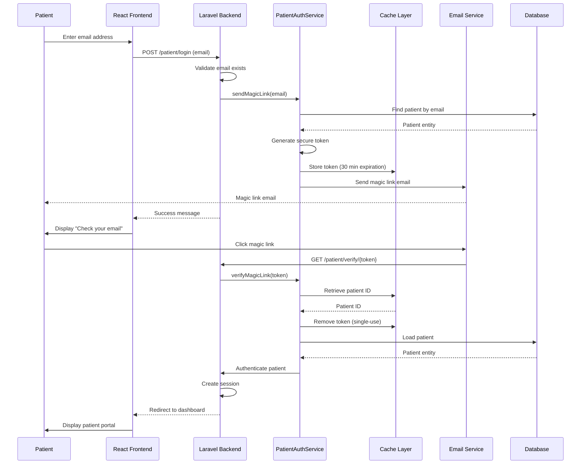
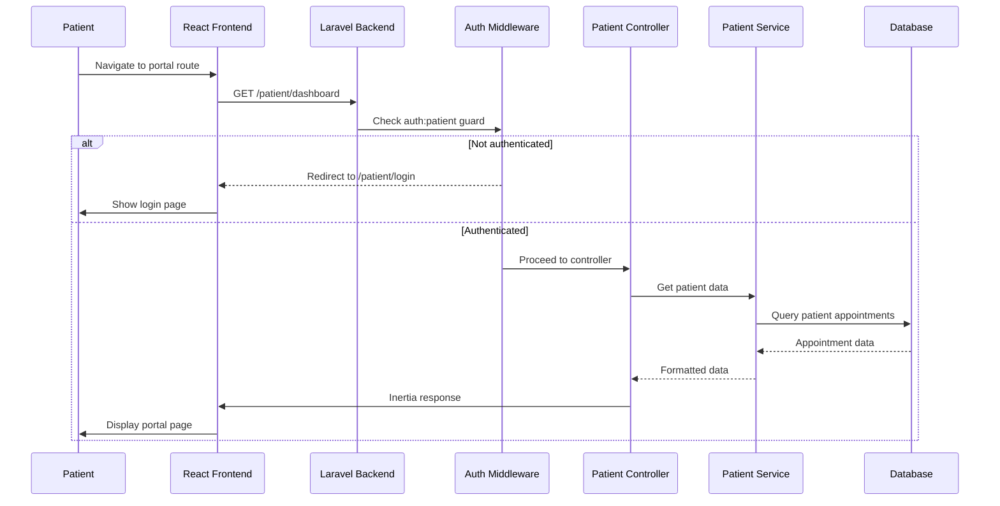
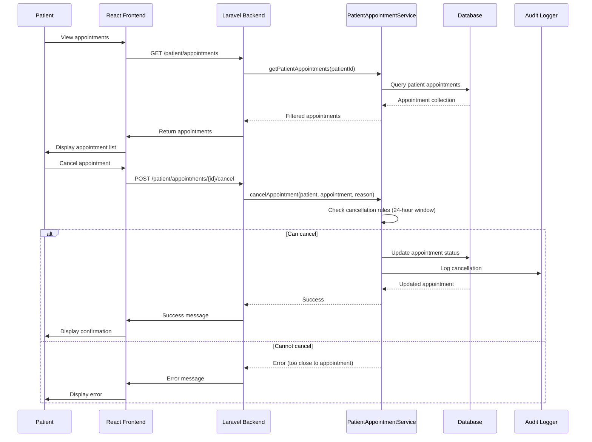
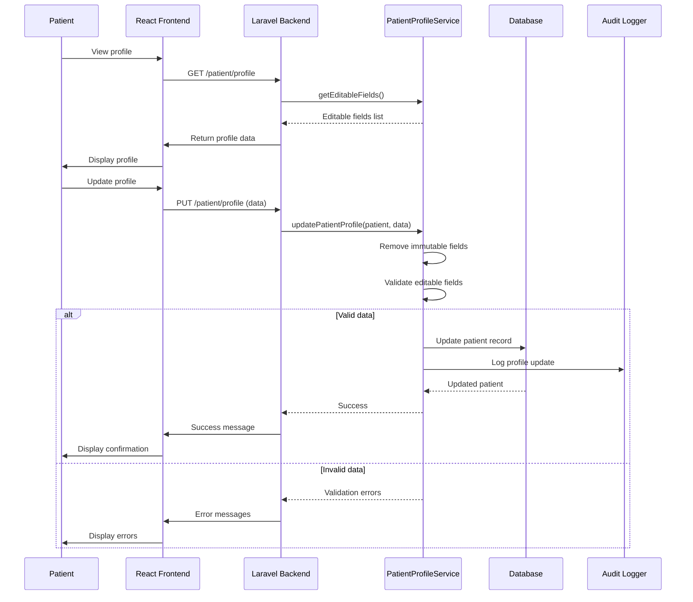

# ClinicFlow Data Flow

## Overview

This document describes the data flows and operational sequences within ClinicFlow, including normal operation flows, incident handling, and integration with SentinelStack for monitoring and audit purposes.

## Normal Operation Flows

### Patient Authentication Flow

**Key Steps:**
1. Patient enters email address on login page
2. System validates email exists in database
3. Service generates secure token and stores in cache (30-minute expiration)
4. Magic link email sent to patient
5. Patient clicks link in email
6. System verifies token and retrieves patient ID
7. Token removed from cache (single-use)
8. Patient authenticated and session created
9. Patient redirected to dashboard

### Patient Portal Access Flow

**Key Steps:**
1. Patient attempts to access portal route
2. Middleware checks `auth:patient` guard
3. If not authenticated, redirect to login
4. If authenticated, load patient data and appointments
5. Return Inertia response with data
6. Frontend renders patient portal

### Patient Appointment Management Flow

**Key Steps:**
1. Patient views their appointments (filtered by patient ID)
2. Patient attempts to cancel appointment
3. Service checks business rules (24-hour window, status)
4. If allowed, appointment status updated to cancelled
5. Audit log created for cancellation
6. Success or error response returned

### Patient Profile Management Flow

**Key Steps:**
1. Patient views their profile
2. Patient updates editable fields (email, phone, address)
3. Service removes immutable fields (MRN, DOB, name)
4. Service validates remaining fields
5. If valid, patient record updated
6. Audit log created for profile update
7. Success or validation errors returned

### Patient Registration Flow

**Key Steps:**
1. User enters patient demographic information
2. Frontend validates client-side and submits to backend
3. Backend validates and authorizes request
4. Service layer generates unique medical record number
5. Patient record created in database
6. Audit log entry created for compliance
7. Event forwarded to SentinelStack for monitoring
8. Success response returned to frontend

### Appointment Scheduling Flow

**Key Steps:**
1. User selects patient, clinician, and appointment time
2. System validates availability constraints
3. Conflicts checked against existing appointments
4. If available, appointment created
5. Audit log entry created
6. Event sent to SentinelStack
7. Success or error response returned

### Exam Room Assignment Flow

**Key Steps:**
1. User selects exam room for existing appointment
2. System verifies room is active and available
3. Checks for scheduling conflicts at appointment time
4. Updates appointment with room assignment
5. Audit log captures before/after state
6. Event forwarded to SentinelStack
7. Updated appointment returned to frontend

## Incident Detection and Handling

### Error Detection Flow

**Incident Types:**
- **Application Errors**: Exceptions, validation failures, business rule violations
- **Database Errors**: Connection failures, constraint violations, query timeouts
- **External Service Errors**: SentinelStack integration failures, third-party API errors
- **Security Events**: Failed authentication attempts, authorization violations, suspicious activity

### Audit Logging Flow

**Audit Log Characteristics:**
- **Immutable**: Once created, audit logs cannot be modified or deleted
- **Complete**: Captures who, what, when, where, and why
- **Tamper-evident**: Timestamps and cryptographic hashing (future enhancement)
- **Queryable**: Indexed for efficient retrieval during audits

## SentinelStack Integration Flow

### Metrics Collection Flow

**Metrics Collected:**
- Request latency (p50, p95, p99)
- Error rates by endpoint
- Request volume by endpoint
- Database query performance
- Cache hit/miss ratios

### Event Forwarding Flow

**Event Types:**
- **Audit Events**: All user actions (create, update, delete, read sensitive data)
- **Security Events**: Authentication, authorization failures, suspicious activity
- **Business Events**: Appointment scheduled, room assigned, patient registered
- **System Events**: Errors, performance degradation, health status changes

### Health Status Reporting

**Health Check Components:**
- Database connectivity and query performance
- Cache availability and response time
- Disk space and system resources
- External service dependencies
- Application memory and performance metrics

## Data Flow Patterns

### Request-Response Pattern

Standard synchronous request handling:
1. Client sends HTTP request
2. Middleware processes (auth, logging, metrics)
3. Controller handles request
4. Service executes business logic
5. Database operations (transactional)
6. Audit logging
7. Response formatted and returned
8. Metrics updated

### Event-Driven Pattern

Asynchronous event processing:
1. Business event occurs
2. Event dispatched to listeners
3. Listeners process asynchronously
4. Queue jobs for external integrations
5. Workers process jobs with retry logic
6. External systems notified (SentinelStack)

### Audit-First Pattern

All mutations go through audit logging:
1. Before mutation: Capture current state
2. Execute mutation
3. After mutation: Capture new state
4. Create audit log entry with before/after
5. Forward audit event to SentinelStack
6. Return mutation result

This ensures complete audit trail even if mutation succeeds but audit fails (transaction rollback).

## Performance Considerations

### Batch Processing

- Audit events batched and sent periodically (every 5 seconds or 100 events)
- Metrics aggregated and sent in batches (every 30 seconds)
- Reduces network overhead and SentinelStack load

### Async Processing

- Non-critical events processed asynchronously via queue
- Prevents blocking user requests for external integrations
- Retry logic handles transient failures

### Caching Strategy

- Frequently accessed data cached (patient lookup, room availability)
- Cache invalidation on data mutations
- Reduces database load for read-heavy operations

