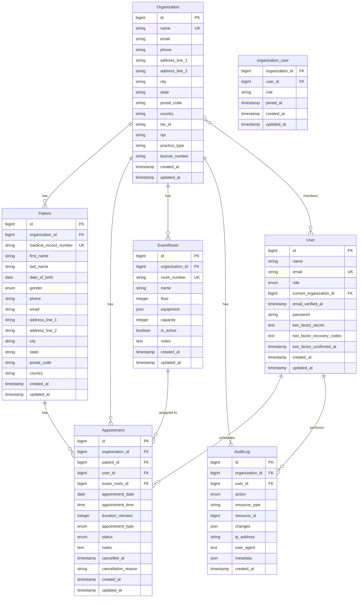

# ClinicFlow Domain Model

## Overview

The ClinicFlow domain model represents the core business entities and their relationships within an outpatient clinic management system. All entities are designed to support synthetic data generation and demonstrate healthcare application patterns without handling real Protected Health Information (PHI).

## Core Entities

### Patient

Represents a registered patient in the clinic system. Contains synthetic demographic information for demonstration purposes. Each patient belongs to a specific organization.

**Key Attributes:**
- `id`: Unique identifier
- `organization_id`: Foreign key to Organization (required)
- `medical_record_number`: Unique medical record identifier (unique within organization)
- `first_name`: Patient first name
- `last_name`: Patient last name
- `date_of_birth`: Patient date of birth
- `gender`: Patient gender (enum)
- `phone`: Contact phone number
- `email`: Contact email address (optional)
- `address_line_1`: Primary address line
- `address_line_2`: Secondary address line (optional)
- `city`: City
- `state`: State or province
- `postal_code`: Postal or ZIP code
- `country`: Country code
- `created_at`: Record creation timestamp
- `updated_at`: Record last update timestamp

**Business Rules:**
- Medical record number must be unique within an organization
- Date of birth must be in the past
- Email, if provided, must be valid format
- All address fields required except address_line_2
- Patient must belong to an organization

### Appointment

Represents a scheduled appointment between a patient and a clinician. Each appointment belongs to a specific organization.

**Key Attributes:**
- `id`: Unique identifier
- `organization_id`: Foreign key to Organization (required)
- `patient_id`: Foreign key to Patient
- `user_id`: Foreign key to User (clinician/staff)
- `exam_room_id`: Foreign key to ExamRoom (nullable, assigned later)
- `appointment_date`: Scheduled date
- `appointment_time`: Scheduled time
- `duration_minutes`: Expected appointment duration
- `appointment_type`: Type of appointment (enum: routine, follow_up, consultation, etc.)
- `status`: Appointment status (enum: scheduled, in_progress, completed, cancelled, no_show)
- `notes`: Additional appointment notes (optional)
- `cancelled_at`: Cancellation timestamp (nullable)
- `cancellation_reason`: Reason for cancellation (nullable)
- `created_at`: Record creation timestamp
- `updated_at`: Record last update timestamp

**Business Rules:**
- Appointment date and time must be in the future when created
- Duration must be positive
- Status transitions must be valid (scheduled → in_progress → completed, or scheduled → cancelled)
- Cannot schedule overlapping appointments for same clinician within the same organization
- Cannot assign multiple appointments to same exam room at overlapping times within the same organization
- Cancellation requires cancellation_reason if status is cancelled
- Appointment must belong to an organization
- Patient, user, and exam room must belong to the same organization

### ExamRoom

Represents a physical exam room within the clinic. Each exam room belongs to a specific organization.

**Key Attributes:**
- `id`: Unique identifier
- `organization_id`: Foreign key to Organization (required)
- `room_number`: Unique room identifier (string, unique within organization)
- `name`: Display name for the room
- `floor`: Floor number where room is located
- `equipment`: JSON array of available equipment
- `capacity`: Maximum occupancy
- `is_active`: Whether room is currently available for use
- `notes`: Additional room information (optional)
- `created_at`: Record creation timestamp
- `updated_at`: Record last update timestamp

**Business Rules:**
- Room number must be unique within an organization
- Capacity must be positive
- Only active rooms can be assigned to appointments
- Equipment list stored as JSON for flexibility
- Exam room must belong to an organization

### Organization

Represents a clinic organization (tenant) in the multi-tenant system. Each organization is isolated from others with its own users, patients, appointments, and resources.

**Key Attributes:**
- `id`: Unique identifier
- `name`: Organization/clinic name
- `email`: Organization contact email
- `phone`: Organization contact phone
- `address_line_1`: Primary address line
- `address_line_2`: Secondary address line (optional)
- `city`: City
- `state`: State or province
- `postal_code`: Postal or ZIP code
- `country`: Country code
- `tax_id`: Tax ID or EIN (optional)
- `npi`: National Provider Identifier (optional)
- `practice_type`: Type of medical practice
- `license_number`: Business license number (optional)
- `created_at`: Record creation timestamp
- `updated_at`: Record last update timestamp

**Business Rules:**
- Name must be unique
- Email must be valid format if provided
- Users can belong to multiple organizations
- Each organization has isolated data (patients, appointments, exam rooms)

### User

Represents a system user (clinician or administrative staff). Users can belong to multiple organizations with different roles in each. Extends Laravel's base User model with additional clinic-specific attributes.

**Key Attributes:**
- `id`: Unique identifier
- `name`: Full name
- `email`: Email address (unique)
- `role`: System-level role (enum: SuperAdmin, User)
- `current_organization_id`: Foreign key to currently selected Organization (nullable)
- `email_verified_at`: Email verification timestamp
- `password`: Hashed password
- `two_factor_secret`: Two-factor authentication secret (encrypted)
- `two_factor_recovery_codes`: Recovery codes (encrypted)
- `two_factor_confirmed_at`: 2FA confirmation timestamp
- `created_at`: Record creation timestamp
- `updated_at`: Record last update timestamp

**Relationships:**
- `organizations()`: Many-to-many relationship with Organization via `organization_user` pivot table
- `currentOrganization()`: Belongs to relationship with Organization (current selection)

**Business Rules:**
- Email must be unique
- Role must be valid enum value (SuperAdmin for system admins, User for all others)
- Organization-specific roles (Owner, Admin, Clinician, Receptionist) are stored in the `organization_user` pivot table
- Password must meet security requirements (handled by Laravel)
- Two-factor authentication optional but recommended for sensitive roles
- SuperAdmin users can access all organizations without membership

### AuditLog

Represents an immutable audit log entry for compliance and accountability. Each audit log entry is associated with an organization for multi-tenant isolation.

**Key Attributes:**
- `id`: Unique identifier
- `organization_id`: Foreign key to Organization (required)
- `user_id`: Foreign key to User (who performed action)
- `action`: Action performed (enum: create, read, update, delete, login, logout, etc.)
- `resource_type`: Type of resource affected (e.g., Patient, Appointment)
- `resource_id`: ID of affected resource
- `changes`: JSON object representing state changes (before/after)
- `ip_address`: IP address of request
- `user_agent`: User agent string
- `metadata`: Additional context as JSON
- `created_at`: Action timestamp (immutable)

**Business Rules:**
- All audit logs are append-only (no updates or deletes)
- Changes field captures before/after state for update actions
- IP address and user agent recorded for security auditing
- Metadata field allows extensibility without schema changes
- Audit log must belong to an organization for tenant isolation

## Entity Relationships

## Relationship Details

### Organization → User (Many-to-Many)

- Users can belong to multiple organizations with different roles in each
- Relationship managed via `organization_user` pivot table
- Pivot table stores organization-specific role (Owner, Admin, Clinician, Receptionist)
- User's `current_organization_id` tracks their active organization context
- SuperAdmin users can access all organizations without explicit membership

### Organization → Patient (One-to-Many)

- Each organization has its own set of patients
- Patients are isolated per organization (multi-tenant data isolation)
- Medical record numbers are unique within an organization

### Organization → Appointment (One-to-Many)

- Each organization has its own appointments
- Appointments are isolated per organization
- All related entities (patient, user, exam room) must belong to the same organization

### Organization → ExamRoom (One-to-Many)

- Each organization has its own exam rooms
- Room numbers are unique within an organization
- Rooms are isolated per organization

### Organization → AuditLog (One-to-Many)

- Each organization has its own audit log entries
- Audit logs provide tenant isolation for compliance tracking
- All audit logs associated with organization-specific resources

### Patient → Appointment (One-to-Many)

- A patient can have multiple appointments over time within their organization
- Appointments are retained even after patient record updates (historical integrity)
- Cascade delete not recommended; mark patient as inactive instead

### User → Appointment (One-to-Many)

- A user (clinician/staff) can be assigned to multiple appointments within their organization
- Supports tracking clinician workload and availability
- Foreign key enforces referential integrity
- User must be a member of the appointment's organization

### ExamRoom → Appointment (One-to-Many)

- An exam room can be assigned to multiple appointments over time within its organization
- Supports room utilization tracking
- Nullable foreign key allows scheduling before room assignment
- Business logic prevents overlapping room assignments within the same organization

### User → AuditLog (One-to-Many)

- Every user action generates an audit log entry
- Supports accountability and compliance auditing
- Foreign key ensures user cannot be deleted if audit logs exist
- Audit logs are scoped to the organization context

## Business Rules and Constraints

### Appointment Scheduling

1. **Time Validation**
   - Appointment time must be during clinic operating hours
   - Appointment date cannot be in the past
   - Duration must be reasonable (minimum 15 minutes, maximum 240 minutes)

2. **Availability Constraints**
   - Clinician cannot have overlapping appointments
   - Exam room cannot be double-booked for overlapping times
   - Room assignment optional at scheduling time but required before appointment start

3. **Status Transitions**
   - Valid transitions: `scheduled → in_progress → completed`
   - Valid transitions: `scheduled → cancelled` (with reason)
   - Valid transitions: `scheduled → no_show` (marked by staff)
   - No reverse transitions (completed cannot become scheduled)

### Data Integrity

1. **Referential Integrity**
   - All foreign keys enforced at database level
   - Soft deletes considered but not implemented (hard deletes with audit trail)

2. **Uniqueness Constraints**
   - Medical record number unique per patient
   - Room number unique per exam room
   - Email unique per user
   - No duplicate appointments (same patient, clinician, date, time)

3. **Audit Trail Requirements**
   - All create, update, delete operations logged
   - Read operations logged for sensitive data access
   - Authentication events (login, logout) logged
   - Changes captured as before/after JSON for updates

## Data Generation Guidelines

Since ClinicFlow uses only synthetic data:

1. **Patient Data**
   - Use Faker library for name generation
   - Generate realistic but fake dates of birth
   - Use randomly generated phone numbers and emails
   - Ensure medical record numbers are unique and non-sequential

2. **Temporal Relationships**
   - Appointments should align with patient registration dates
   - Appointment history should show realistic patterns
   - Room assignments should follow logical clinic workflows

3. **Consistency**
   - Maintain referential integrity in generated data
   - Ensure realistic data volumes for demonstration
   - Generate data that supports typical clinic workflows

