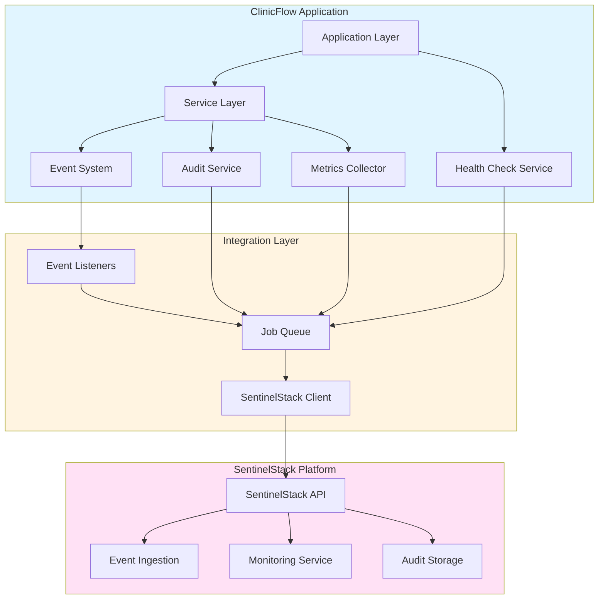
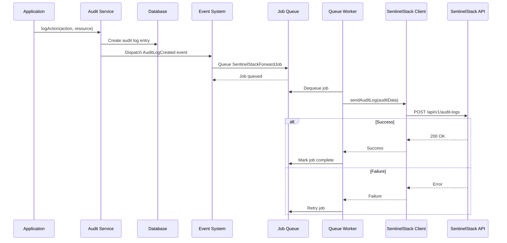
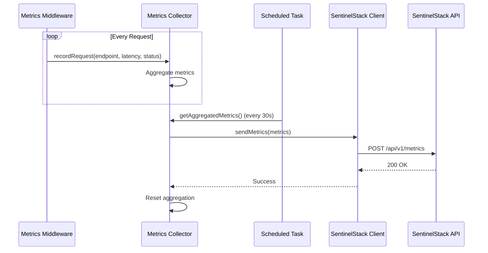
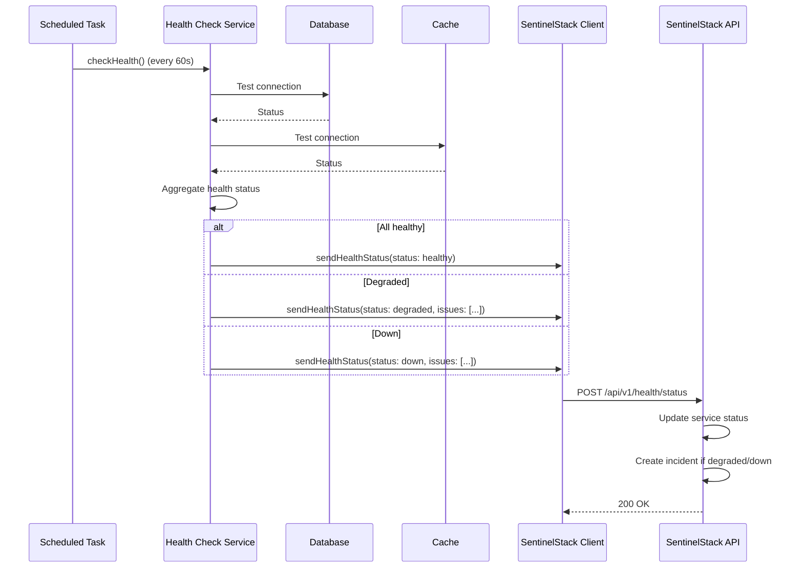

# SentinelStack Integration

## Overview

ClinicFlow integrates with SentinelStack to demonstrate how a healthcare application can provide operational visibility, security monitoring, and compliance-ready audit trails. This document describes the integration architecture, event schemas, and implementation approach.

**Integration Approach:** ClinicFlow uses a hybrid integration model. The architecture includes clear integration points and interfaces where SentinelStack integration would occur, with conceptual documentation of event flows and schemas. Actual SentinelStack SDK integration can be implemented when the SentinelStack platform is available.

## Integration Architecture



## Integration Points

### 1. Service Health Metrics

**Purpose:** Monitor application performance, availability, and resource usage.

**Metrics Collected:**
- Request latency (p50, p95, p99 percentiles)
- Request volume by endpoint
- Error rates by endpoint and error type
- Database query performance
- Cache hit/miss ratios
- Memory and CPU usage
- Active user sessions

**Collection Method:**
- Middleware captures request start/end times
- Metrics aggregated in-memory
- Batched transmission every 30 seconds or 1000 events

**Event Schema:**
```json
{
  "event_type": "service_metrics",
  "timestamp": "2024-01-15T10:30:00Z",
  "service_id": "clinicflow",
  "environment": "production",
  "metrics": {
    "request_latency_p50": 45,
    "request_latency_p95": 120,
    "request_latency_p99": 250,
    "request_volume": 1250,
    "error_rate": 0.002,
    "database_query_time_avg": 12,
    "cache_hit_rate": 0.85
  },
  "period": {
    "start": "2024-01-15T10:29:30Z",
    "end": "2024-01-15T10:30:00Z"
  }
}
```

### 2. Incident Tracking

**Purpose:** Log system errors, exceptions, and incidents for monitoring and alerting.

**Incident Types:**
- Application exceptions
- Database errors
- External service failures
- Security events (failed authentication, authorization violations)
- Performance degradation
- Resource exhaustion

**Collection Method:**
- Exception handler captures all exceptions
- Security events logged by authentication/authorization middleware
- Health checks detect degraded service states
- Events sent immediately for critical incidents, batched for non-critical

**Event Schema:**
```json
{
  "event_type": "incident",
  "timestamp": "2024-01-15T10:30:15Z",
  "incident_id": "inc_abc123",
  "service_id": "clinicflow",
  "severity": "high",
  "category": "application_error",
  "title": "Database Connection Timeout",
  "description": "Failed to establish database connection after 5 seconds",
  "context": {
    "exception_type": "Illuminate\\Database\\QueryException",
    "message": "SQLSTATE[HY000] [2002] Connection timed out",
    "stack_trace": "...",
    "user_id": "user_123",
    "request_id": "req_xyz789",
    "endpoint": "/api/appointments"
  },
  "metadata": {
    "environment": "production",
    "server": "app-server-01",
    "region": "us-east-1"
  }
}
```

### 3. Audit Log Forwarding

**Purpose:** Forward all audit log entries to SentinelStack for centralized compliance auditing.

**Audit Events:**
- User authentication (login, logout, failed attempts)
- User authorization (access granted/denied)
- Data access (read operations on sensitive data)
- Data modifications (create, update, delete)
- Configuration changes
- User management actions

**Collection Method:**
- Audit service creates local audit log entry
- Event listener queues audit event for forwarding
- Events sent asynchronously via job queue
- Guaranteed delivery with retry logic

**Event Schema:**
```json
{
  "event_type": "audit_log",
  "timestamp": "2024-01-15T10:30:20Z",
  "audit_log_id": "audit_123456",
  "service_id": "clinicflow",
  "user_id": "user_123",
  "user_email": "clinician@example.com",
  "action": "update",
  "resource_type": "Appointment",
  "resource_id": "appt_789",
  "ip_address": "192.168.1.100",
  "user_agent": "Mozilla/5.0...",
  "changes": {
    "before": {
      "status": "scheduled",
      "exam_room_id": null
    },
    "after": {
      "status": "scheduled",
      "exam_room_id": "room_456"
    }
  },
  "metadata": {
    "reason": "Room assignment",
    "request_id": "req_xyz789"
  }
}
```

### 4. Access Control Events

**Purpose:** Monitor authentication and authorization events for security analysis.

**Event Types:**
- Successful authentication
- Failed authentication attempts
- Session creation and termination
- Permission checks (granted/denied)
- Role assignments
- Password changes
- Two-factor authentication events

**Collection Method:**
- Authentication events from Laravel Fortify
- Authorization events from policy checks
- Session events from session middleware
- Events sent immediately for security relevance

**Event Schema:**
```json
{
  "event_type": "access_control",
  "timestamp": "2024-01-15T10:30:25Z",
  "service_id": "clinicflow",
  "event_subtype": "authentication_success",
  "user_id": "user_123",
  "user_email": "clinician@example.com",
  "ip_address": "192.168.1.100",
  "user_agent": "Mozilla/5.0...",
  "context": {
    "method": "password",
    "two_factor_used": true,
    "session_id": "sess_abc123"
  },
  "metadata": {
    "environment": "production",
    "request_id": "req_xyz789"
  }
}
```

## Implementation Architecture

### Integration Service Interface

```php
<?php

namespace App\Services\Integration;

interface SentinelStackClientInterface
{
    public function sendMetrics(array $metrics): void;
    
    public function sendIncident(array $incident): void;
    
    public function sendAuditLog(array $auditLog): void;
    
    public function sendAccessControlEvent(array $event): void;
    
    public function sendHealthStatus(array $healthStatus): void;
}
```

### Event Listener Implementation

```php
<?php

namespace App\Listeners;

use App\Events\PatientCreated;
use App\Services\Integration\SentinelStackClientInterface;
use Illuminate\Contracts\Queue\ShouldQueue;

class ForwardAuditToSentinelStack implements ShouldQueue
{
    public function __construct(
        private SentinelStackClientInterface $client
    ) {}
    
    public function handle(PatientCreated $event): void
    {
        $this->client->sendAuditLog([
            'event_type' => 'audit_log',
            'action' => 'create',
            'resource_type' => 'Patient',
            'resource_id' => $event->patient->id,
            'user_id' => auth()->id(),
            // ... additional fields
        ]);
    }
}
```

### Metrics Collection Middleware

```php
<?php

namespace App\Http\Middleware;

use App\Services\Integration\MetricsCollector;
use Closure;
use Illuminate\Http\Request;

class CollectMetrics
{
    public function __construct(
        private MetricsCollector $collector
    ) {}
    
    public function handle(Request $request, Closure $next)
    {
        $startTime = microtime(true);
        $response = $next($request);
        $duration = (microtime(true) - $startTime) * 1000;
        
        $this->collector->recordRequest(
            $request->path(),
            $request->method(),
            $response->status(),
            $duration
        );
        
        return $response;
    }
}
```

## Data Flow Sequences

### Audit Event Flow



### Metrics Aggregation Flow



### Health Status Reporting Flow



## Configuration

### Environment Variables

```env
SENTINELSTACK_ENABLED=true
SENTINELSTACK_API_URL=https://api.sentinelstack.com
SENTINELSTACK_API_KEY=your_api_key_here
SENTINELSTACK_SERVICE_ID=clinicflow
SENTINELSTACK_ENVIRONMENT=production
SENTINELSTACK_METRICS_INTERVAL=30
SENTINELSTACK_HEALTH_CHECK_INTERVAL=60
SENTINELSTACK_QUEUE_CONNECTION=redis
```

### Service Configuration

```php
// config/sentinelstack.php

return [
    'enabled' => env('SENTINELSTACK_ENABLED', false),
    'api_url' => env('SENTINELSTACK_API_URL'),
    'api_key' => env('SENTINELSTACK_API_KEY'),
    'service_id' => env('SENTINELSTACK_SERVICE_ID', 'clinicflow'),
    'environment' => env('SENTINELSTACK_ENVIRONMENT', 'development'),
    'metrics' => [
        'enabled' => true,
        'interval_seconds' => env('SENTINELSTACK_METRICS_INTERVAL', 30),
        'batch_size' => 1000,
    ],
    'health_check' => [
        'enabled' => true,
        'interval_seconds' => env('SENTINELSTACK_HEALTH_CHECK_INTERVAL', 60),
    ],
    'queue' => [
        'connection' => env('SENTINELSTACK_QUEUE_CONNECTION', 'default'),
        'queue' => 'sentinelstack',
    ],
];
```

## Error Handling and Resilience

### Retry Strategy

- Exponential backoff for transient failures
- Maximum retry attempts: 5
- Retry intervals: 1s, 2s, 4s, 8s, 16s
- Dead letter queue for permanently failed events

### Circuit Breaker

- Open circuit after 5 consecutive failures
- Half-open state after 60 seconds
- Close circuit after successful request in half-open state

### Fallback Behavior

- Continue application operation if SentinelStack unavailable
- Store events locally for later retry (future enhancement)
- Log integration failures for manual review
- Alert administrators of integration failures

## Security Considerations

### Authentication

- API key authentication with SentinelStack
- API key stored securely (encrypted in configuration)
- Key rotation procedures (procedural)

### Data Transmission

- All communications over HTTPS/TLS
- Certificate validation
- Request signing (future enhancement)

### Data Privacy

- No PHI included in metrics or health status
- Audit logs include resource IDs but not sensitive data
- User identifiers (email) included for accountability
- IP addresses included for security analysis

## Future Enhancements

### Real-Time Event Streaming

- WebSocket connection for real-time event streaming
- Lower latency for critical events
- Reduced overhead for high-volume events

### Local Buffering

- Local event buffer for resilience
- Automatic replay of buffered events
- Configurable buffer size and retention

### Advanced Analytics

- Custom metric calculations
- Anomaly detection integration
- Predictive analytics hooks

### Multi-Tenant Support

- Tenant identification in events
- Tenant-specific metrics aggregation
- Isolated audit trails per tenant

